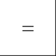
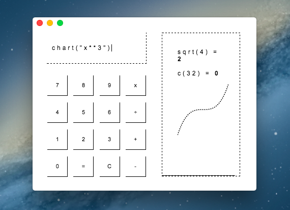

# Count

Count is a calculator app. It saves your calculations between sessions. Press up or down to scroll through inputs. Be careful - pressing "C" will delete your history.

Count is a window into the JavaScript interpreter, so you can do things like define variables and perform operations using them. There are also custom functions, listed below.

You can use Count in your web browser by visting count.fyi (this won't save your calculation history, though).

## Functions

* c(number): convert to fahrenheit
* f(number): convert to celsius
* sqrt(number): take square root
* sum(numbers): add numbers
* mean(numbers): get average of numbers
* roots(a, b, c): get roots of quadratic function
* sin(n), cos(n), tan(n): trig functions
* extent(array): get min and max of array of numbers
  * for example, extent([1,2,3,4,5]) returns 1,5
* chart(function): plot chart
  * for example, chart("x*x") or chart("-x")
* random(min, max): return a random number between min and max
* hex(r,g,b): convert hex to rgb
* rgb(hex): convert rgb to hex

## To Do
- [ ] add more math functions, unit conversion, constants
- [ ] Array manipulation
- [ ] Date manipulation
- [x] up and down arrow to access history
- [x] d3 charting
- [x] sounds
- [x] help()
- [x] random numbers
- [x] Convert hex to rgb and vice-versa

